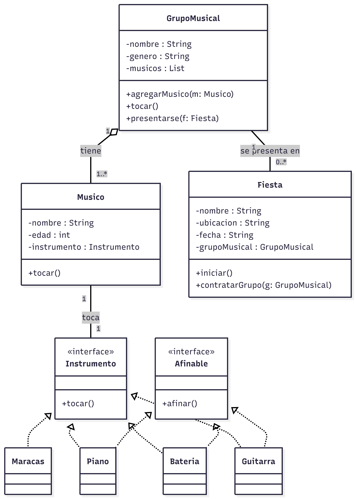

# Modelos_Actividad1
Descripción del Ejercicio

Este proyecto consiste en el modelado de un sistema orientado a objetos que representa la estructura y funcionamiento de un grupo musical que participa en distintos eventos o fiestas.

El objetivo principal es aplicar conceptos fundamentales de Programación Orientada a Objetos (POO) y modelado UML, tales como:

- Clases y atributos
- Métodos
- Interfaces
- Asociaciones
- Agregación
- Multiplicidad
- Delegación de responsabilidades

---

Estructura del Modelo

El sistema está compuesto por las siguientes clases principales:

GrupoMusical

Representa el conjunto de músicos que conforman el grupo.
Contiene un arreglo (o lista) de músicos y permite agregar integrantes, presentarse en eventos y ejecutar la acción de tocar como conjunto.

Músico

Representa a cada integrante del grupo.
Cada músico posee exactamente un instrumento y puede ejecutar la acción de tocar.

Instrumento (Interfaz)

Define el comportamiento general que todo instrumento debe implementar, específicamente el método "tocar()".

Afinable (Interfaz)

Define el comportamiento "afinar()", el cual solo es implementado por aquellos instrumentos que requieren afinación.
Esto permite un diseño más flexible y evita forzar métodos innecesarios en clases que no lo requieren.

Fiesta

Representa el evento donde el grupo musical se presenta.
Contiene una referencia al grupo musical contratado y puede iniciar el evento.

---

Relaciones Entre Clases

- Existe una agregación entre "GrupoMusical" y "Musico", ya que el grupo está compuesto por músicos, pero estos pueden existir independientemente.
- Existe una asociación entre "Musico" e "Instrumento", ya que cada músico utiliza un instrumento.
- "Instrumento" es implementada por clases concretas como "Guitarra", "Bateria", "Piano" y "Maracas".
- Algunos instrumentos implementan adicionalmente la interfaz "Afinable".
- "Fiesta" se asocia con "GrupoMusical", ya que un grupo puede presentarse en distintos eventos.

---

Diagrama UML

El diagrama de clases que representa el modelo puede visualizarse en la imagen o accederse directamente mediante el enlace a Mermaid.

[Link mermaid](https://mermaid.ai/d/bb9d827b-af14-427d-903a-edb739d57986)
