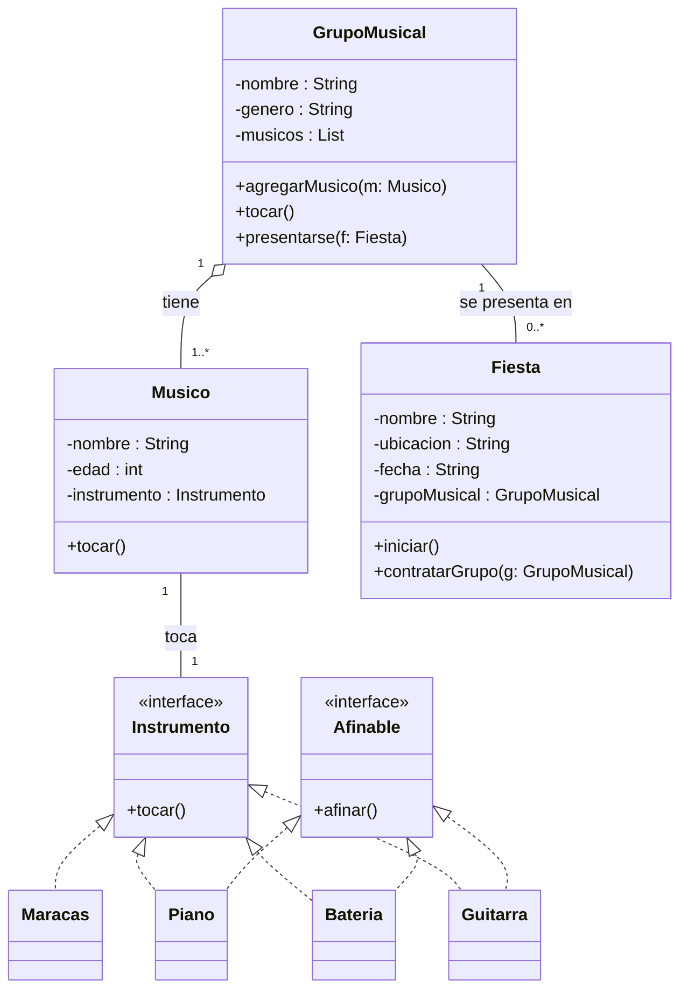

# Modelos_Actividad1

```mermaid
classDiagram

class GrupoMusical {
  -nombre : String
  -genero : String
  -musicos : List<Musico>
  +agregarMusico(m: Musico)
  +tocar()
  +presentarse(f: Fiesta)
}

class Musico {
  -nombre : String
  -edad : int
  -instrumento : Instrumento
  +tocar()
}

class Fiesta {
  -nombre : String
  -ubicacion : String
  -fecha : String
  -grupoMusical : GrupoMusical
  +iniciar()
  +contratarGrupo(g: GrupoMusical)
}

class Instrumento {
  <<interface>>
  +tocar()
}
class Afinable {
  <<interface>>
  +afinar()
}

class Guitarra {
}

class Bateria {
}

class Piano {
}

GrupoMusical "1" o-- "1..*" Musico : tiene
GrupoMusical "1" -- "0..*" Fiesta : se presenta en
Musico "1" -- "1" Instrumento : toca
Instrumento <|.. Guitarra
Instrumento <|.. Bateria
Instrumento <|.. Maracas
Instrumento <|.. Piano

Afinable <|.. Guitarra
Afinable <|.. Bateria
Afinable <|.. Piano
```

[Link mermaid](https://mermaid.ai/d/bb9d827b-af14-427d-903a-edb739d57986)
